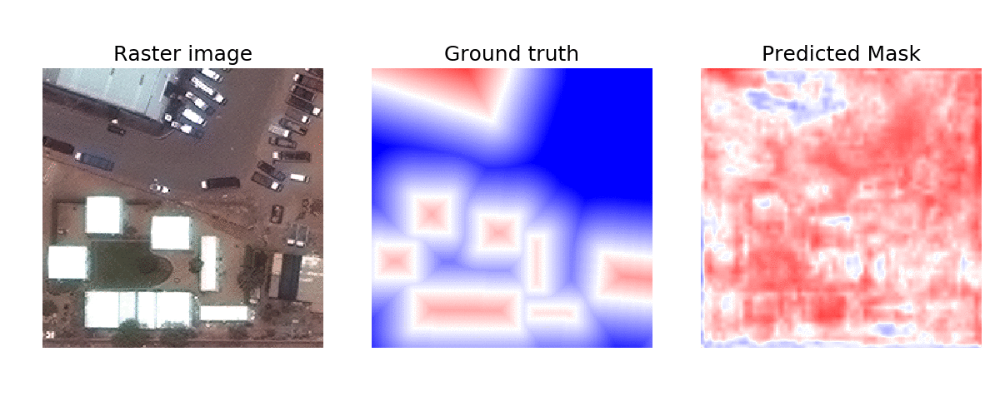

# Looking Glass

Looking Glass is a tool to identify buildings within satellite imagery. Specifically, it uses a segmentation algorithm to label each individual pixel in an image as to whether it's part of a building or not.

**Input**: Satellite image tiles (256x256 pixels) currently @ zoom 18

**Output**: Binary or signed-distance transform mask. In SDT, values represent the predicted distance (in meters) within or outside a building boundary (for positive and negative values, respectively).

Example of training progression. Color intensity represents the predicted distance from building edge. Red pixels are predicted to be within the building footprint while blue pixels are outside.

Project [blog post here](https://medium.com/devseed/mapping-buildings-with-help-from-machine-learning-f8d8d221214a) and a [concrete use case here](https://medium.com/devseed/weaving-automation-into-the-mapping-workflow-adding-ai-to-the-tasking-manager-52172ed2ece8).

## Components within this repo
You'll need an AWS account and access to Digital Globe imagery to make full use of all the code here.

### 0. Configuration params
* config.py

### 1. Data preparation
* proc_preproc_imagery.py - Loads raster imagery and labels
  * Preprocesses large RGB images (e.g., from the SpaceNet Challenge database)
  * Creates and saves binary mask from geojson vector mask
  * Creates and saves signed-distance transform mask
  * Splits directories of large images into 256x256 RGB images and masks; checks for too many black pixels
* utils_labels.py - Helper functions to accomplish preprocessing and cropping in `proc_preproc_imagery.py`

### 2. Training the model
* model_dlab.py - contains Keras code for constructing the DeepLab V3+ model
* train_deeplab.py - runs training based on a set of hyperparameters, autosaves hyperparams and TensorBoard tracking; syncs model and params to S3
* utils_dataflow.py - can return xtrain, xtest, ytrain, ytest from one or more saved datasets
* utils_metrics.py - loss metrics (like Jaccard, F1, etc.) for training. Includes multiple versions since these aren't always well-defined
* utils_training.py - helpers to print out start/finish details, load models from disk, custom TensorBoard callbacks, and sync folders to S3

### 3. Inference and plotting
* pred_plot_examples.py - run basic inference and plot results for some example tiles
* pred_populate_sqs.py - finds all tiles for a given geojson boundary and uses them to populate an AWS SQS queue
* pred_process_sqs.py - fetches SQS messages, downloads the image tiles, runs inference, and stores building area in CSV

## Technical model details
Looking Glass is built on top of the DeepLab V3+ model developed by Google. This model is described in a blog post [here](https://research.googleblog.com/2018/03/semantic-image-segmentation-with.html) and the associated paper is [here](https://arxiv.org/abs/1802.02611).